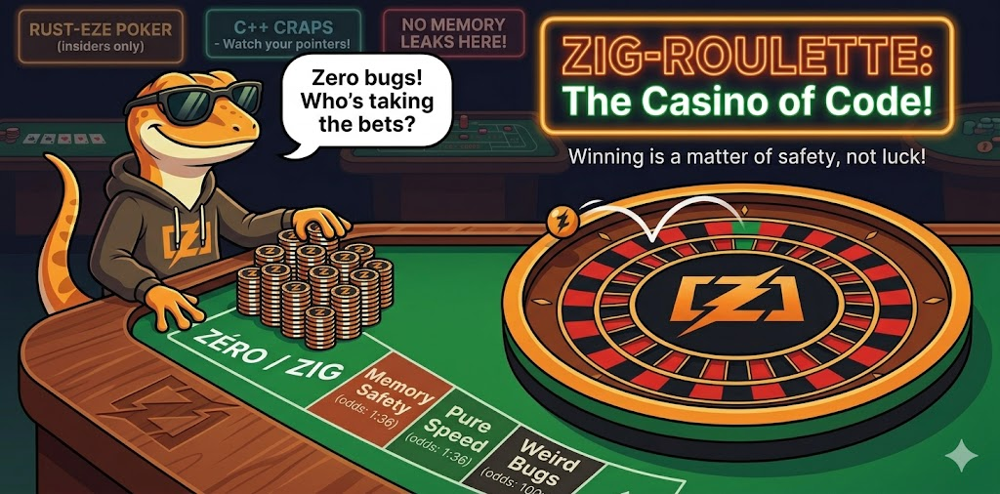

<p align="center">
  
</p>

<h1 align="center">🎰 Zig Roulette</h1>

<p align="center">
  <strong>The Casino of Code.</strong> A native European roulette table for your Linux desktop —<br>
  click your chips, spin the wheel, watch the credits fly. Winning is a matter of safety, not luck.
</p>

<p align="center">
  <a href="https://github.com/InstaZDLL/zig-roulette/releases"></a>
  
  
  
  <a href="https://github.com/InstaZDLL/zig-roulette/blob/main/LICENSE"></a>
</p>

---

## 🎲 Play in 30 seconds

```bash
# Fedora
sudo dnf install zig gtk4-devel libadwaita-devel pkgconf-pkg-config
# Debian/Ubuntu
sudo apt install zig libgtk-4-dev libadwaita-1-dev pkg-config

zig build run
```

You start with **1000 credits**. Pick an amount, click a zone on the table to drop a bet,
hit **Lancer**, and pray to the RNG gods. The wheel spins in real Cairo, the ball lands,
the history panel keeps the receipts. 🧾

## ✨ What you get

- 🎡 A real European wheel, hand-drawn with Cairo and spun with eased animation
- 🖱️ Click-to-bet table — straights, colors, parity, ranges, dozens, columns
- 💰 Live session balance, active-bet list, and a color-coded win/loss history
- ↩️ One-click **Max**, **undo last bet**, and **new session** controls
- 🌑 A moody dark casino theme, SVG logo, desktop launcher & AppStream metadata
- ✅ Pure, tested game logic that runs without ever opening a window

## 🎯 Bets on the table

| Bet | Options | Pays |
|---|---|---|
| Straight | any number `0–36` | 35:1 |
| Color | 🔴 Rouge / ⚫ Noir | 1:1 |
| Parity | Pair / Impair | 1:1 |
| Range | `1–18` / `19–36` | 1:1 |
| Dozen | `1–12` / `13–24` / `25–36` | 2:1 |
| Column | COL 1 / COL 2 / COL 3 | 2:1 |

> `0` is the house's friend: it sinks every even-money and group bet. 🟢

## 🧱 Under the hood

The code is split into small, single-purpose modules with a clean dependency graph
(`main → ui → render → app → gtk`, plus `wheel` and `game` as shared leaves):

```text
src/
├── game.zig     # pure roulette rules + payouts (GUI-free, fully unit-tested)
├── gtk.zig      # hand-written GTK4/libadwaita/Cairo/GLib bindings
├── wheel.zig    # wheel geometry + spin easing (pure math)
├── app.zig      # the shared AppState and its types
├── render.zig   # Cairo draw funcs for the wheel & table
├── ui.zig       # widgets, callbacks, animation, refresh
├── main.zig     # tiny entry point
└── style.css    # the theme, loaded via @embedFile
```

The golden rule: **game rules never touch GTK**, so you can test payout math without a display server.

## 🛠️ Dev commands

```bash
zig build              # compile
zig build run          # build & play
zig build test         # run the game-logic unit tests
zig fmt src/*.zig build.zig
./scripts/opengrep.sh  # static analysis (SAST) — add --sarif to emit a report
```

Want it installed system-wide? `zig build install --prefix ~/.local` drops the binary,
`.desktop` launcher, icons, and AppStream metadata under the `dev.instazdll.ZigRoulette` app id.

## 📜 License

Licensed under the **European Union Public Licence v1.2**. See [LICENSE](LICENSE).

<p align="center"><sub>A small personal project, built for fun and for learning Zig. 🦎</sub></p>
