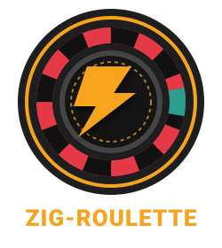

<p align="center">
  
</p>

<h1 align="center">Zig Roulette</h1>

<p align="center">
  <strong>European Roulette Desktop Game</strong><br>
  <em>Play a native GTK4/libadwaita roulette table with clickable bets, animated spins, and local session credits.</em><br>
  <sub>A small personal project built for fun and learning.</sub>
</p>

<p align="center">
  <a href="https://github.com/InstaZDLL/zig-roulette/releases"></a>
  
  
  
  
  
  <a href="https://github.com/InstaZDLL/zig-roulette/blob/main/LICENSE"></a>
  
</p>

## Table of Contents

- [Overview](#overview)
- [Features](#features)
- [Tech Stack](#tech-stack)
- [Prerequisites](#prerequisites)
- [Installation](#installation)
- [Usage](#usage)
- [Project Structure](#project-structure)
- [Commands](#commands)
- [Testing](#testing)
- [Static Analysis](#static-analysis)
- [Desktop Metadata](#desktop-metadata)
- [License](#license)

## Overview

The app is a small native casino game for Linux desktops. The UI uses GTK4/libadwaita, while the roulette rules live in a separate Zig module so payout behavior can be tested without launching the GUI.

Supported roulette bets:

- Straight number: `0-36`
- Color: red or black
- Parity: even or odd
- Range: `1-18`, `19-36`
- Dozens: `1-12`, `13-24`, `25-36`
- Columns: `COL 1`, `COL 2`, `COL 3`

## Features

- European roulette wheel drawn with Cairo
- Clickable betting table
- Direct bet placement from table clicks
- Session balance starting at `1000` credits
- Active bet list with structured rows
- Color-coded result history
- Last-bet undo button
- Max amount button
- Full new-session reset
- Dark casino-style GTK theme
- SVG logo, rendered PNG icon variants, Linux `.desktop` launcher, and AppStream metadata
- Unit tests for core game rules

## Tech Stack

- Zig `0.16.0`
- GTK4
- libadwaita
- GLib/GObject
- Cairo drawing through GTK

## Prerequisites

Install Zig and the GTK development packages.

Fedora:

```bash
sudo dnf install zig gtk4-devel libadwaita-devel pkgconf-pkg-config
```

Ubuntu/Debian:

```bash
sudo apt install zig libgtk-4-dev libadwaita-1-dev pkg-config
```

The project was validated locally with:

- Zig `0.16.0`
- GTK `4.22.4`
- libadwaita `1.9.1`

## Installation

Build the project:

```bash
zig build
```

Install to the default Zig prefix:

```bash
zig build install
```

Install to a custom prefix:

```bash
zig build install --prefix ~/.local
```

This installs:

- `bin/zig-roulette`
- `share/applications/dev.instazdll.ZigRoulette.desktop`
- `share/metainfo/dev.instazdll.ZigRoulette.metainfo.xml`
- `share/icons/hicolor/scalable/apps/dev.instazdll.ZigRoulette.svg`
- `share/icons/hicolor/<size>x<size>/apps/dev.instazdll.ZigRoulette.png` for `16`, `32`, `48`, `64`, `128`, `256`, and `512`

## Usage

Run from the source tree:

```bash
zig build run
```

After installation:

```bash
zig-roulette
```

Gameplay flow:

1. Choose a bet amount.
2. Use `Max` if you want to bet the available balance.
3. Click a zone on the roulette table to add that bet.
4. Add more bets, repeat the selected bet, or undo the last bet if needed.
5. Press `Lancer`.
6. Read the result, updated balance, and history in the right panel.

## Project Structure

```text
.
├── assets/
│   ├── icons/
│   └── logo.svg
├── data/
│   ├── dev.instazdll.ZigRoulette.desktop
│   └── dev.instazdll.ZigRoulette.metainfo.xml
├── src/
│   ├── game.zig
│   └── main.zig
├── build.zig
├── build.zig.zon
└── README.md
```

## Commands

```bash
zig build        # Compile the application
zig build run    # Run the GTK app
zig build test   # Run unit tests for roulette logic
zig fmt src/*.zig build.zig
./scripts/opengrep.sh   # Static analysis (SAST)
```

## Testing

The tests cover core roulette behavior in `src/game.zig`:

- Straight number payout
- Zero losing color/parity bets
- Dozen and column payouts
- Invalid and over-balance bets
- Undoing the last active bet
- Balance reset behavior

Run them with:

```bash
zig build test
```

## Static Analysis

Static analysis (SAST) runs with [Opengrep](https://opengrep.dev), locally and in CI
(`.github/workflows/opengrep.yml`, which publishes results to GitHub Code Scanning).

```bash
./scripts/opengrep.sh           # human-readable scan
./scripts/opengrep.sh --sarif   # also write opengrep.sarif
```

The scan combines the Opengrep registry (`--config auto`, no token required) with the
project rules in `.opengrep/rules/`. Zig has no native Opengrep parser, so `.zig` files
are checked with the language-agnostic `generic` engine; add your own rules to
`.opengrep/rules/zig-generic.yml`.

Install Opengrep with:

```bash
curl -fsSL https://raw.githubusercontent.com/opengrep/opengrep/main/install.sh | bash
```

## Desktop Metadata

The project includes:

- `assets/logo.svg`
- `assets/icons/logo-*.png`
- `data/dev.instazdll.ZigRoulette.desktop`
- `data/dev.instazdll.ZigRoulette.metainfo.xml`

The build installs the desktop launcher, AppStream metadata, SVG icon, and PNG icon variants using the app id `dev.instazdll.ZigRoulette`, so desktop menus can resolve the application after installation.

## License

Licensed under the European Union Public Licence v1.2. See [LICENSE](LICENSE).
